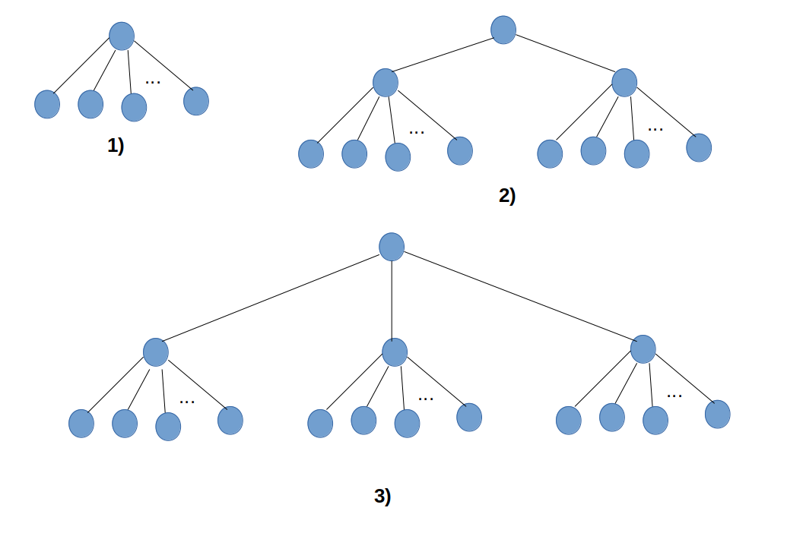
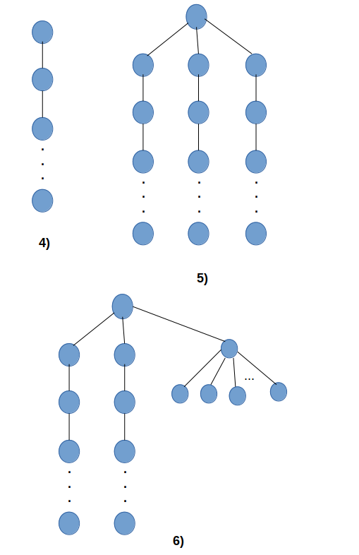

## Project

This project implements the lottery scheduler in xv6, a unix based operating system developed by MIT

---

## Lottery Scheduler

- A process is assigned some tickets when it is created. The scheduler generates
  a random number and based on that decides which process is to be scheduled.
- Most of the scheduler logic code resides in *proc.c*.
- Flow :
  1. The scheduler finds out the total tickets of the *RUNNABLE* processes.
  (The different states of the process can be found in *proc.h*.)
  2. If non-zero *RUNNABLE* processes are found, then scheduler generates a random
  number (*rand.c*). The random number generator used is **linear feedback shift
  register** random number generator. Information about this can be found [here](https://en.wikipedia.org/wiki/Linear-feedback_shift_register).
  3. The scheduler then finds the process to be scheduled by adding the tickets
  of the *RUNNABLE* processes and then selecting that process at which the total
  tickets count becomes just greater than the random number.

---

## How to run ?

- The repo contains a folder *xv6* that contains the original xv6 code. The
  original xv6 code can also be found [here](https://github.com/mit-pdos/xv6-public.).
  Refer the *ADDED_MODIFIED.md* file to see the new files added and the modified
  ones.
- Run the script *copy_files.sh* to copy the new files in the *xv6* folder. This
  will replace some files of the original xv6 code in xv6 folder.
- To run xv6 OS, an emulator **qemu** is required. qemu is free and open source
  emulator that performs hardware virtualization. Install qemu using : `sudo apt-get install qemu`
- Open the *xv6* folder and type `make qemu-nox` to run qemu on existing
  terminal. Or type `make qemu` to run qemu on new window.
- For **testing**, type `make qemu-nox TEST_FLAG=SCHED_TEST`. This sets the
  testing flag to *SCHED_TEST* in Makefile and enables code required for testing.
- To clean the files generated during compilation, type `make clean`.
- To exit qemu, type `Ctrl-A` followed by letter `X`.

---

## Code files

1. *assign-tickets* : This is an user program that allows the user to change the
   tickets assigned to the process. This program makes a system call to enter
   kernel to assign the tickets.
2. *defs.h* : Contains the definitions of kernel functions.
3. *param.h* : Contains kernel level macros.
4. *proc.c* : Contains all code related to the process creation, termination,
   scheduling, etc.
5. *proc.h* : Contains the cpu structure, proc structure, proc states.
6. *ps.c* : User program that allows the user to see process info : pid, tickets
   and ticks. Makes a system call to retrieve the information.
7. *rand.c* : Contains code for random number generation.
8. *scheduler-test.c* : Contains code for testing the scheduler. Refer below to
   see the testing procedure.
9. *sched_test_utils.c, sched_test_utils.h* : Contains some utility function
   required for testing.
10. *sleep.c* : User program to sleep for some timeticks. Timeticks increments at
   each timer interrupt.
11. *syscall.c, syscall.h* : Contains various system call entries and function
    to be called.
12. *sysproc* : Contains the implementation of system calls. (like
    assign-tickets, proc_info, ...).
13. *types.h* : Contains the data types and process info structure.
14. *user.h* : Contains the all callable function prototypes and system call
    that can be made by user.
15. *usys.S* : Assembly code that loads register with syscall number, makes
   syscall and make transition to the kernel mode using *int* instruction.

---

## Testing procedure

- Refer the file *scheduler-test.c* to see how the lottery scheduler testing is
  done.
- The general test procedure is that the parent (the test program) creates a
  number of child process in different fashion, then the parent process
  sleep for some ticks, retrieve the process info of all children and then kill
  the children and then print the number of ticks each child was scheduled. Also
  the program prints the scheduling order by switching on SCHED_TEST flag during
  compilation.

- Following are test cases in the *scheduler-test.c* program :
    1. Testcase 1 : The parent process itself forks a number of child processes.
    2. Testcase 2 : The parent process itself forks 2 processes and then those
       2 processes further forks remaining process.
    3. Testcase 3 : The parent process itself forks 3 processes and then those
       3 processes further forks remaining process.
    4. Testcase 4 : The parent process forks a process A that process A in turn
       forks another process B and that process B forks another process C and so
       on. Thus forking nested processes.
    5. Testcase 5 : The parent process forks 3 processes and those 3 processes
       further forks nested processes.
    6. Testcase 6 : Hybrid case. The parent process forks 3 processes, out
       of which 2 processes further forks nested processes and the remaining 1
       process forks multiple child process.
- The diagram show the parent and forked child processes in different testcases :

- Testing can be done in two mode : **auto** and **manual**.
- In **manual** testing more, the test program takes input :
    1. The timeticks for which parent process must sleep. (Generally **1 tick = 10ms**,
   depends on cpu bus freq. Eg: *300 ticks* corresponds to *3 sec* sleep).
    2. The tickets to be assigned for the parent process.
    3. The tickets to be assigned for the child processes. Depending on number
       of child process tickets given as input, the test program decides the
       number of children to be forked.
- Then the program forks required children and assign their tickets.
- Then a system call is made to get info about child processes.
- Then the program goes to sleep for some timeticks entered by user and allow
  the child processes to get scheduled.
- Then again system call is made to get info about child processes.
- Printing the difference of ticks before and after parent going to sleep let us
  know for how many ticks individual child process was scheduled. The program
  also outputs the scheduling order.

- In **auto** testing mode, user need to type `scheduler-test auto` on the xv6
  prompt. The testing process as that of manual mode but doesn't need to provide
  input explicitly.
  The *scheduler-test.c* program forks some processes automatically,
  assign them some tickets, let parent sleep for some ticks. The auto testing
  configuration can be changed by change 3-4 **AUTO-TEST** MACROs in
  *scheduler-test.c*. Eg: The number of process to be forked thus changing
  sleepticks, parent tickets, etc. The **AUTO-TEST** MACRO names are self-explainatory.

- By setting/clearing the *PRINT_SCHED_ORDER* MACRO in *scheduler-test.c*, we
  can choose to print scheduling order or not. Scheduling order : Prints a
  sequence of pid of the process and number of ticks it has been scheduled
  consecutively.

- **Results** :
    1. The results were that the process which was assigned relatively more
    tickets had more ticks (more scheduled) than the lesser ones.
    2. The scheduling order is random too, but gives relatively more chances to
       the process with higher tickets.
    3. If number of process to be forked, are quite large compared to sleeping
       ticks of parent process, there might be slight changes in the number of
       ticks than expected results. If the number of process to be forked are
       large give sufficient sleep ticks (In auto mode, sleep ticks = 100 *
       number of child process).
    4. Testing screenshots are also uploaded on repo. 3 tests are done. For 1st
       test, scheduling order is printed. For next two tests, scheduling order
       is not printed as it is a long sequence. The final summary is printed for
       these 2 tests. 2nd test is auto and 3rd is manual.

---

## Supporting info

- The ticks variable tells us how many times the process has been scheduled. The
  global 'ticks' variable gets incremented at every timer interrupt.
- The timer interrupt is approximately equal to 10ms but depends on the cpu bus
  frequency. Thus timer interrupt duration can be changed by adjusting the
  countdown value in TICR register of the APIC hardware. (Refer *lapic.c* file).

---

## Important info

- Increase *MAX_CHILD_PROCESS* MACRO in the *scheduler-test.c* file to fork more
  process.
- While testing, if number of child process to be created is more and prompt
  shows 'too many arguments', increase the value of *MAXARGS* in *sh.c*.
- For some testcase (i.e. testcase 4, 5, 6 where forking nested processes are
  involved) its implementation consists of creating pipes. Multiple such pipes
  are created. So, testing program make display error for creating pipes. To 
  handled this, increase the value of *NOFILE* MACRO in *param.h*.
